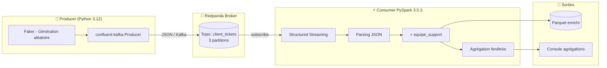

# 🎫 PoC InduTechData – Pipeline de gestion de tickets en temps réel

Pipeline de traitement de tickets client en streaming avec **Redpanda** (broker Kafka-compatible) et **Apache Spark Structured Streaming**, entièrement conteneurisé avec Docker Compose.

> **Contexte** : Projet 9 OpenClassrooms – Modélisation d'une infrastructure dans le cloud (InduTechData). Ce PoC démontre la faisabilité d'une architecture de streaming temps réel pour la gestion des demandes client.

---

## 📐 Architecture du pipeline



Voir `docs/pipeline.mmd` pour le diagramme source.

---

## 🧱 Composants

| Service | Image | Rôle | Ports |
|---|---|---|---|
| **redpanda** | `redpandadata/redpanda:v24.2.7` | Broker Kafka-compatible | 19092, 18081, 9644 |
| **redpanda-console** | `redpandadata/console:v2.7.2` | UI web de monitoring | 8090 → 8080 |
| **topic-setup** | `redpandadata/redpanda:v24.2.7` | Crée le topic `client_tickets` | — |
| **producer** | Build local (Python 3.12-slim) | Génère des tickets aléatoires (Faker) | — |
| **consumer** | Build local (apache/spark:3.5.3-python3) | Consomme, enrichit, agrège, exporte en Parquet | 4040 |

---

## 📋 Prérequis

- **Docker** ≥ 24 + **Docker Compose** v2 (testé avec Rancher Desktop 29.1.4 + Compose v5.0.1)
- **8 Go de RAM** disponibles minimum
- **5 Go d'espace disque**
- (Optionnel) **Python 3.12** + `pandas`, `pyarrow` pour inspecter les Parquet

---

## 🚀 Lancement rapide

```bash
cd indutech-tickets-poc
docker compose up -d --build
docker compose ps
docker compose logs -f consumer
```

⏱️ Premier démarrage : ~5-10 min. Démarrages suivants : ~30 s.

---

## ✅ Vérification

### a) Interface web Redpanda Console
Ouvrir **http://localhost:8090** → Topics → `client_tickets` (3 partitions) → onglet Messages.

### b) Logs du producer
```bash
docker compose logs --tail 20 producer
```
```
[OK] Ticket envoyé | topic=client_tickets partition=2 offset=14 key=CLI-3829
```

### c) Logs du consumer (agrégations toutes les 20 s)
```bash
docker compose logs --tail 50 consumer
```
```
+------------------------+------------+--------+----------+
|window                  |type_demande|priorite|nb_tickets|
+------------------------+------------+--------+----------+
|{2026-05-15 18:40,18:41}|technique   |haute   |3         |
|{2026-05-15 18:40,18:41}|réclamation |critique|2         |
+------------------------+------------+--------+----------+
```

### d) Fichiers Parquet générés
```powershell
dir output\tickets_enriched
```

### e) Inspecter le contenu (Python local)
```python
import pandas as pd
df = pd.read_parquet('output/tickets_enriched')
print(df.head(10))
print('Total tickets:', len(df))
print(df['equipe_support'].value_counts())
```

---

## 📂 Structure du projet

```
indutech-tickets-poc/
├── docker-compose.yml
├── README.md
├── .gitignore
├── producer/
│   ├── Dockerfile
│   ├── requirements.txt
│   └── producer.py
├── consumer/
│   ├── Dockerfile
│   ├── requirements.txt
│   └── spark_consumer.py
├── docs/
│   └── pipeline.mmd
└── output/
    └── tickets_enriched/
```

---

## 🔬 Détail des données

### Format d'un ticket
```json
{
  "ticket_id": "TKT-9d3f8b2a-...",
  "client_id": "CLI-4827",
  "timestamp": "2026-05-15T18:40:23.412Z",
  "demande": "Problème de connexion à mon compte",
  "type_demande": "technique",
  "priorite": "haute"
}
```

### Enrichissement (consumer)

| type_demande | equipe_support |
|---|---|
| technique | Support N2 |
| facturation | Comptabilité |
| commercial | Service commercial |
| réclamation | Service qualité |
| information | Support N1 |

### Agrégation fenêtrée
- Fenêtre tumbling de 1 minute
- Watermark de 30 secondes
- Groupement : `window` × `type_demande` × `priorite`
- Métrique : nombre de tickets

---

## ⚙️ Optimisations Spark

| Paramètre | Valeur | Justification |
|---|---|---|
| `spark.driver.memory` | 1g | Charge maîtrisée (POC) |
| `spark.executor.memory` | 1g | Idem |
| `spark.sql.shuffle.partitions` | 4 | Réduit l'overhead sur petit volume |
| `maxOffsetsPerTrigger` | 1000 | Backpressure |
| Mode `local[*]` | — | Utilise tous les cœurs |
| JARs Kafka pré-installés | ✅ | Évite la résolution Ivy au runtime |

---

## 🛡️ Résilience & gestion d'erreurs

- Healthcheck Redpanda (`rpk cluster health` toutes les 15 s)
- `depends_on: service_healthy` pour producer/consumer
- `failOnDataLoss = false` côté Spark
- Checkpointing Spark via `_spark_metadata`
- Callback Kafka de delivery dans le producer
- `flush()` à l'arrêt du producer (SIGINT)

---

## 🛑 Arrêt et nettoyage

```bash
docker compose down              # arrêt simple
docker compose down -v           # nettoyage complet (volumes + réseau)
```

---

## 🐞 Dépannage

| Symptôme | Cause probable | Solution |
|---|---|---|
| `port is already allocated` | Port 8080 occupé | Mapper sur 8090 |
| Consumer en `Restarting` | Permissions Ivy | `mkdir -p` + `chmod 777` dans Dockerfile |
| Pas de messages dans Console | Topic non créé | `docker exec -it redpanda rpk topic list` |
| Spark ne lit pas Kafka | JARs Kafka manquants | Pré-installer les JARs dans `/opt/spark/jars/` |
| Bitnami image not found | Bitnami payant depuis 08/2025 | Utiliser `apache/spark:3.5.3-python3` |

---

## 📚 Références

- [Redpanda Documentation](https://docs.redpanda.com/)
- [Apache Spark Structured Streaming + Kafka](https://spark.apache.org/docs/3.5.3/structured-streaming-kafka-integration.html)
- [Migration Bitnami → Apache officiel](https://www.docker.com/blog/broadcoms-new-bitnami-restrictions-migrate-easily-with-docker/)

---
